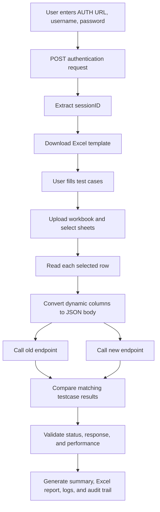
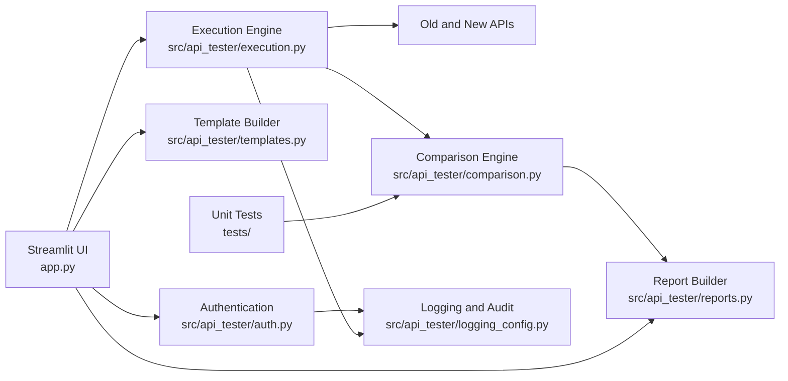

# API Test Framework

Streamlit-based framework for validating old and new API behavior from Excel test cases, with authentication, parallel execution, detailed comparison reports, logs, and an audit trail.

## Features

- Authenticates against a user-provided auth URL and extracts `sessionID`.
- Generates Excel templates for:
  - `claims_adjuster`
  - `claims_details`
  - `claims_search`
  - `claims_consumers`
- Uploads Excel workbooks containing one or all supported sheets.
- Executes old and new APIs per test case with `Content-Type` and `IDS-SESSION-ID` headers.
- Supports parallel execution.
- Compares matching old/new responses by `TestcaseNumber`.
- Validates HTTP status, response body, performance, and exact JSON differences.
- Uses DeepDiff for robust nested JSON response comparison.
- Supports SSL verification, custom CA bundles, and test-only SSL verification disablement.
- Produces downloadable Excel reports with audit details.
- Includes a dedicated comparison lab UI to test comparison behavior without calling real APIs.
- Writes structured logs and audit trails to `logs/`.

## Flowchart



## Architecture



## Project Structure

```text
.
├── app.py
├── LICENSE
├── requirements.txt
├── docs/
│   ├── ARCHITECTURE.md
│   └── FLOW.md
├── src/api_tester/
│   ├── auth.py
│   ├── comparison.py
│   ├── execution.py
│   ├── logging_config.py
│   ├── reports.py
│   └── templates.py
└── tests/
    └── test_comparison.py
```

## Setup

```bash
python -m venv .venv
source .venv/bin/activate
pip install -r requirements.txt
```

## Run

```bash
streamlit run app.py
```

The app opens at the local URL printed by Streamlit, commonly `http://localhost:8501`.

## Test

```bash
pytest
```

## Excel Test Case Format

Every sheet includes these common columns:

- `TestcaseNumber`
- `oldendpoint`
- `newendpoint`
- `method`

All other non-empty columns are converted into the JSON request body for that row.

## Notes

- The report compares the old and new API results from the same row and same `TestcaseNumber`.
- Request bodies exclude `TestcaseNumber`, `oldendpoint`, `newendpoint`, and `method`.
- Nested response differences are reported using DeepDiff paths such as `root['claim']['payments'][0]['amount']`.
- Reports include `differences_summary` for QA-friendly review and `differences_raw` for technical traceability.
  Example: `For claim > payments > record 1, field amount changed from 40 in old API to 50 in new API.`
  Added records are also called out clearly, for example: `New API added claim > payments > record 2 with value {"amount": 50, "id": 2}.`
- If internal APIs fail with `SSL_CERTIFICATE_VERIFY_FAILED`, provide a custom CA bundle path in the UI. Disabling SSL verification is available only for trusted test environments.
- Logs are written under `logs/api_testing.log`.
- Audit events are written under `logs/audit_trail.jsonl`.

## License

This project is licensed under the MIT License. See [LICENSE](LICENSE).
