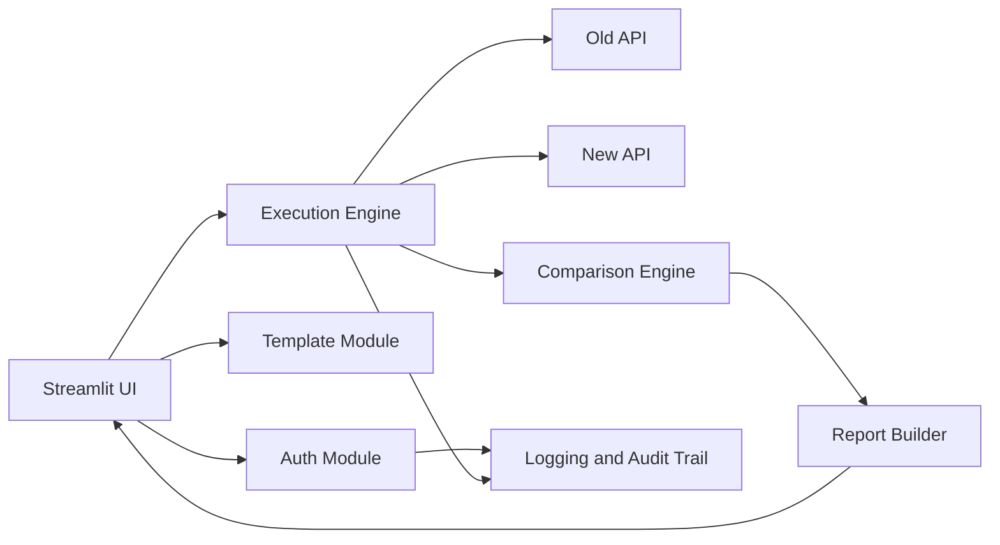

# Architecture

## Components

## Module Responsibilities

| Module | Responsibility |
| --- | --- |
| `app.py` | Streamlit pages, forms, file upload, report download, comparison lab |
| `src/api_tester/auth.py` | Authentication request and `sessionID` extraction |
| `src/api_tester/templates.py` | Supported sheets and Excel template generation |
| `src/api_tester/execution.py` | Row parsing, request creation, parallel old/new API execution |
| `src/api_tester/comparison.py` | Status, response, performance, and JSON diff comparison |
| `src/api_tester/reports.py` | Excel report and summary generation |
| `src/api_tester/logging_config.py` | Application logging and JSONL audit trail |
| `tests/` | Automated validation of comparison behavior |

## Execution Model

The execution engine uses `ThreadPoolExecutor` to process test case rows in parallel. Each row is self-contained, so old and new endpoint calls are compared only within the same row and same `TestcaseNumber`.

## Audit Trail

Audit events are written to `logs/audit_trail.jsonl`. Events include authentication start/success, execution start/completion, and testcase start/completion. Runtime logs are written to `logs/api_testing.log`.
