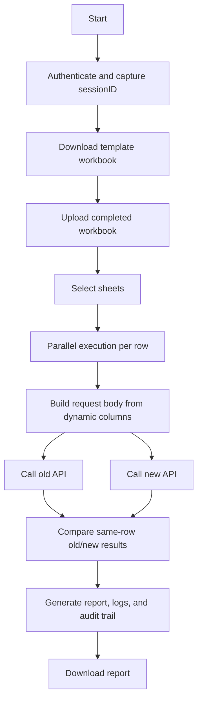

# Application Flow

## 1. Authentication

The user provides:

- `AUTH URL`
- `username`
- `password`

The tool sends a `POST` request with the credentials and extracts `sessionID` from the authentication response. The session ID is used in downstream API calls as `IDS-SESSION-ID`.

## 2. Template Download

The user selects one or more supported sheets:

- `claims_adjuster`
- `claims_details`
- `claims_search`
- `claims_consumers`

The tool generates an Excel workbook. Every sheet contains these common columns:

- `TestcaseNumber`
- `oldendpoint`
- `newendpoint`
- `method`

All remaining dynamic columns become the JSON request body during execution.

## 3. Upload Test Case Excel File

The user uploads the completed workbook and can run:

- all supported sheets found in the workbook
- a manually selected subset of sheets

## 4. Execution Logic

For every row in each selected sheet:

1. Convert dynamic columns into a JSON request body.
2. Build request headers with `Content-Type: application/json` and `IDS-SESSION-ID`.
3. Call the old endpoint and the new endpoint for the same row.
4. Compare old and new results for that exact `TestcaseNumber`.
5. Validate:
   - HTTP status
   - response body
   - nested JSON differences using DeepDiff
   - performance timing
   - exact response differences
6. Generate a downloadable Excel report.

## Flowchart

